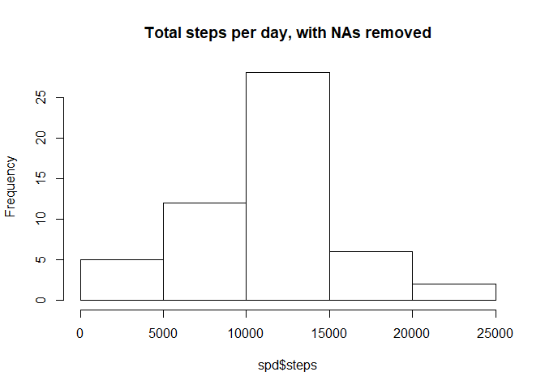
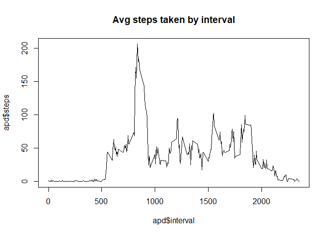
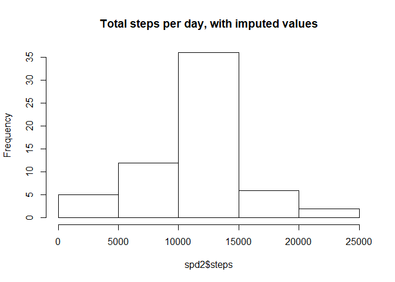

###Loading and preprocessing the data 

```r
Data<-read.csv("activity.csv")
Data_RM<-subset(Data,!is.na(steps))
```

###What is mean total number of steps taken per day? 

```r
spd<-aggregate(steps~date,FUN = sum,data = Data_RM)
hist(spd$steps,main="Total steps per day, with NAs removed")
```

<!-- -->

mean of total number of steps taken per day:

```r
mean(spd$steps)
```

```
## [1] 10766.19
```

median of total number of steps taken per day:

```r
median(spd$steps)
```

```
## [1] 10765
```

###What is the average daily activity pattern?

```r
apd<-aggregate(steps~interval,FUN = mean,data = Data_RM)
plot(apd$interval,apd$steps,type="l", main="Avg steps taken by interval")
```

<!-- -->

The 5-minute interval that contains the maximum number of steps:

```r
apd$interval[which(apd$steps==max(apd$steps))]
```

```
## [1] 835
```

###Imputing missing values

total number of missing values:

```r
nrow(subset(Data,is.na(steps)))
```

```
## [1] 2304
```

The missing values are replaced with average of steps in the 5»min interval across all days; The new dataset is created here.

```r
Data2 <- Data
for (i in 1:nrow(Data)){
  if (is.na(Data[i,1])){
    Data2[i,1]=apd[which(apd$interval==Data[i,3]),2]
  }
}
```

Mean and median of total number of steps taken perday:

```r
spd2<-aggregate(steps~date,FUN = sum,data = Data2)
hist(spd2$steps,main="Total steps per day, with imputed values")
```

<!-- -->

```r
mean(spd2$steps)
```

```
## [1] 10766.19
```

```r
median(spd2$steps)
```

```
## [1] 10766.19
```

The difference between using/not using imputed values

```r
mean(spd2$steps)-mean(spd$steps)
```

```
## [1] 0
```

```r
median(spd2$steps)-median(spd$steps)
```

```
## [1] 1.188679
```

###Are there differences in activity patterns between weekdays and weekends?

Add a new factor variable in the dataset with two levels - "weekday" and "weekend"


```r
Data2$Is_weekday=!(weekdays(as.Date(Data2$date,format="%Y-%m-%d")) %in% c("Saturday","Sunday"))
Data2$Is_weekday[Data2$Is_weekday==TRUE]="weekday"
Data2$Is_weekday[Data2$Is_weekday==FALSE]="weekend"
```

Comparison of weekday vs. weekend average activities


```r
library(ggplot2)
```

```
## Warning: package 'ggplot2' was built under R version 3.4.4
```

```r
apd2<-aggregate(steps~interval+Is_weekday,FUN = mean,data = Data2)
ggplot(apd2,aes(interval,steps))+geom_line()+facet_grid(Is_weekday ~.)
```

<!-- -->


